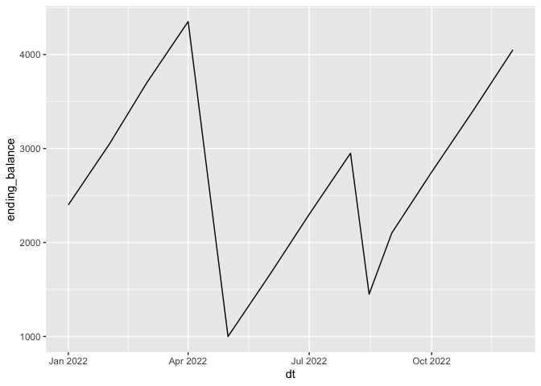
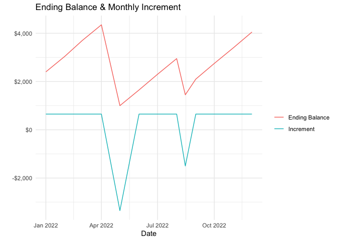
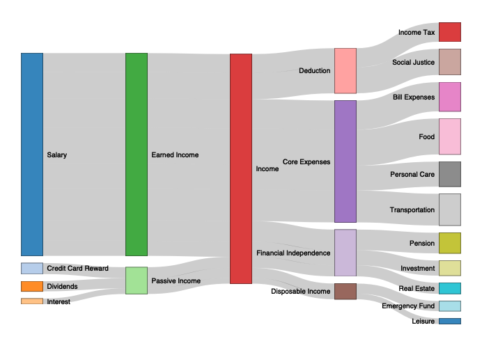
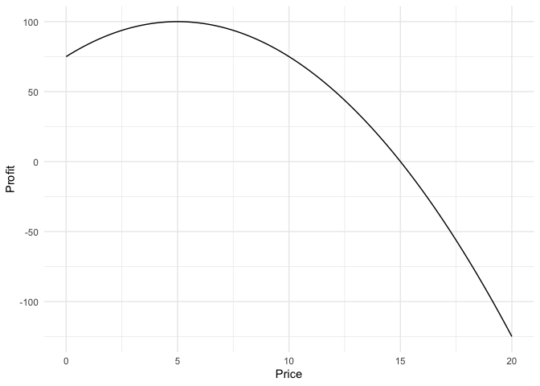
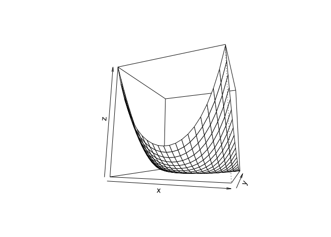
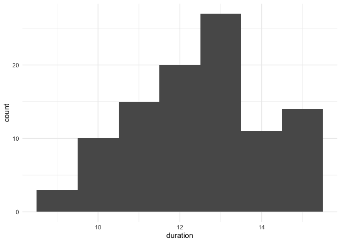

Why not R?
================
Peter Rabinovitch
2022-11-04 16:13:44

# Introduction

Data is the foundation for business. Our business schools, at both
undergraduate and MBA levels, need to prepare students for the
data-driven world, where data is abundant, messy, heterogeneous, and
potentially valuable.

The tools being used are frequently sub-optimal - likely the tools that
the professors are comfortable with, rather than what is truly useful in
today’s world. Changing the set of tools students learn will doubtless
cause some transitional pain for the faculty, but this can be minimized
by choosing a small set of tools that can serve the students both in
their academic careers, as well as once they graduate.

In this document we propose using the open source package R for such a
purpose. Many will doubtless be aware of R’s facility with statistics,
as that is what it was originally developed for. However, it currently
has many more applications beyond the realm of statistics, and later in
this document we will demonstrate, via a selection of examples, some
that cover the entire gamut of quantitative business courses.

One key advantage of R is that it is open source (i.e. free) and there
are many free resources (eg online text books) that should enable
students and faculty to make this transition at no cost - and with no
recurring costs for software licenses, nor textbook purchases.

One frequent concern from people who have not used open source tools is
where they will get support. One only has to look at the range of online
resources for R to dispel this concern. The community is incredibly
helpful, and usually the answer to any questions is a Google search
away.

Once the right tool is in place, this opens up the possibility of
reforming the curriculum to be more adapted to the tool, and to today’s
business world.

# Why R

R is an open source statistical programming language, and together with
RStudio (a free development environment) and a huge number of freely
available libraries on CRAN (the comprehensive R archive network) and
elsewhere, makes up the R ecosystem.

As a statistical language, you’d be surprised if it did not handle
statistics well - of course it does. But it also handles all sorts of
other quantitative and algorithmic tasks equally well.

One thing you and your students will have to get used to is that it is
command driven - you write code. You do not progress by choosing menu
items. This creates a bit of a learning curve , but has huge benefits,
as you will see below, or even better, see this
<https://www.youtube.com/watch?v=cpbtcsGE0OA>

Start from the premise that no analysis is truly one-off. There are
always changes to the data as glitches are discovered, new analyses are
requested with ‘just one more thing’, and redoing the same analysis
monthly, quarterly, or yearly. And the longer the gap between when you
last performed the analysis and when you need to redo it, the harder it
is to remember all the steps you took.

Reproducibility not only saves you time and effort, but prevents you
from looking stupid when you can not redo the same analysis and get the
same results. R and RStudio facilitate reproducibility as your entire
analysis – code, plots, results, and explanatory text – are all in the
same document and can be rebuilt at the push of a button. This file is a
text document, and so can be shared easily, version controlled, and
collaborated with via, for example, github.

The results can be in a multitude of formats, from html to slides to pdf
files to, yes, if needed, even Excel files.

Code can be hidden so as to not interrupt the business question being
addressed, and unfolded (shown) in order to be able to explain to
stakeholders, or anyone else interested, exactly what steps were taken.
The analyst no longer has to remember all the fiddly details because
they are right there in the document.

R has easy integration to corporate databases (eg SQL), can generate
parametrized reports simply which can be automatically updated and run,
and you can build interactive web applications with it via the Shiny
toolkit.

Ok, enough salesmanship - on to the examples.

# Examples

What follows is a series of examples showing how R can be used for
typical problems in existing quantitative business courses. Doubtless
you may find some of your favourite problems missing from this list, but
I know R is up to the task. And as R’s forte is statistics, we will not
dwell on stats problems here, but rather focus on less obviously
R-friendly problems.

We keep things fairly simple - but of course that means we stay away
from the fancier, and perhaps more optimal approaches, to better
illustrate.

At the start we will explain lots of details, but as we progress we’ll
explain less. The point is not for the reader to understand all the
details (yet) but rather to see what is possible with relatively little
effort.

## Budgets

### A simple personal budget

``` r
# Here we load some needed libraries
library(tidyverse) # for manipulating data
library(lubridate) # to deal easily with dates
```

``` r
# We build a data frame (like a table in Excel) containing one line of our budget
df <- tribble(
  ~dt, ~rent, ~food,~tuition,~entertainment,~telecom, ~salary,
  make_date(2022,1,1),-1250,-500,-1000,-500,-100,4000 
)
```

It looks like this, and is self explanatory:

``` r
df
```

    ## # A tibble: 1 × 7
    ##   dt          rent  food tuition entertainment telecom salary
    ##   <date>     <dbl> <dbl>   <dbl>         <dbl>   <dbl>  <dbl>
    ## 1 2022-01-01 -1250  -500   -1000          -500    -100   4000

Now we want to fill out more months, but most of them will be similar to
January, so we (via the following code) copy & paste

``` r
# one way to add a line
typical_month <- df %>% select(rent:salary)
df <- df %>% bind_rows(
  tibble(dt=make_date(2022,2,1),typical_month))
```

``` r
df
```

    ## # A tibble: 2 × 7
    ##   dt          rent  food tuition entertainment telecom salary
    ##   <date>     <dbl> <dbl>   <dbl>         <dbl>   <dbl>  <dbl>
    ## 1 2022-01-01 -1250  -500   -1000          -500    -100   4000
    ## 2 2022-02-01 -1250  -500   -1000          -500    -100   4000

So now we have two months.

Let us fill out the rest of the year

``` r
# first we generate the dates we will need for each month
months <- seq.Date(from = make_date(2022,3,1), to = make_date(2022,12,1), by = 'month')

# and then we combine these months with the typical monthly budget figures
df <- df %>% bind_rows( tibble(dt=months,typical_month) )
```

And now we have a year:

``` r
df
```

    ## # A tibble: 12 × 7
    ##    dt          rent  food tuition entertainment telecom salary
    ##    <date>     <dbl> <dbl>   <dbl>         <dbl>   <dbl>  <dbl>
    ##  1 2022-01-01 -1250  -500   -1000          -500    -100   4000
    ##  2 2022-02-01 -1250  -500   -1000          -500    -100   4000
    ##  3 2022-03-01 -1250  -500   -1000          -500    -100   4000
    ##  4 2022-04-01 -1250  -500   -1000          -500    -100   4000
    ##  5 2022-05-01 -1250  -500   -1000          -500    -100   4000
    ##  6 2022-06-01 -1250  -500   -1000          -500    -100   4000
    ##  7 2022-07-01 -1250  -500   -1000          -500    -100   4000
    ##  8 2022-08-01 -1250  -500   -1000          -500    -100   4000
    ##  9 2022-09-01 -1250  -500   -1000          -500    -100   4000
    ## 10 2022-10-01 -1250  -500   -1000          -500    -100   4000
    ## 11 2022-11-01 -1250  -500   -1000          -500    -100   4000
    ## 12 2022-12-01 -1250  -500   -1000          -500    -100   4000

Of course we will want to know how much is in our bank account. To make
room for those figures, we create columns with NA’s (Not Available) in
them, to be filled in.

``` r
df$starting_balance <- NA_real_
df$ending_balance <- NA_real_
df
```

    ## # A tibble: 12 × 9
    ##    dt          rent  food tuition entertainment telecom salary starting_balance
    ##    <date>     <dbl> <dbl>   <dbl>         <dbl>   <dbl>  <dbl>            <dbl>
    ##  1 2022-01-01 -1250  -500   -1000          -500    -100   4000               NA
    ##  2 2022-02-01 -1250  -500   -1000          -500    -100   4000               NA
    ##  3 2022-03-01 -1250  -500   -1000          -500    -100   4000               NA
    ##  4 2022-04-01 -1250  -500   -1000          -500    -100   4000               NA
    ##  5 2022-05-01 -1250  -500   -1000          -500    -100   4000               NA
    ##  6 2022-06-01 -1250  -500   -1000          -500    -100   4000               NA
    ##  7 2022-07-01 -1250  -500   -1000          -500    -100   4000               NA
    ##  8 2022-08-01 -1250  -500   -1000          -500    -100   4000               NA
    ##  9 2022-09-01 -1250  -500   -1000          -500    -100   4000               NA
    ## 10 2022-10-01 -1250  -500   -1000          -500    -100   4000               NA
    ## 11 2022-11-01 -1250  -500   -1000          -500    -100   4000               NA
    ## 12 2022-12-01 -1250  -500   -1000          -500    -100   4000               NA
    ## # … with 1 more variable: ending_balance <dbl>

And let us say that we have no salary in May

``` r
df <- df %>% mutate(salary = if_else(dt == make_date(2022,5,1),0,salary))
df
```

    ## # A tibble: 12 × 9
    ##    dt          rent  food tuition entertainment telecom salary starting_balance
    ##    <date>     <dbl> <dbl>   <dbl>         <dbl>   <dbl>  <dbl>            <dbl>
    ##  1 2022-01-01 -1250  -500   -1000          -500    -100   4000               NA
    ##  2 2022-02-01 -1250  -500   -1000          -500    -100   4000               NA
    ##  3 2022-03-01 -1250  -500   -1000          -500    -100   4000               NA
    ##  4 2022-04-01 -1250  -500   -1000          -500    -100   4000               NA
    ##  5 2022-05-01 -1250  -500   -1000          -500    -100      0               NA
    ##  6 2022-06-01 -1250  -500   -1000          -500    -100   4000               NA
    ##  7 2022-07-01 -1250  -500   -1000          -500    -100   4000               NA
    ##  8 2022-08-01 -1250  -500   -1000          -500    -100   4000               NA
    ##  9 2022-09-01 -1250  -500   -1000          -500    -100   4000               NA
    ## 10 2022-10-01 -1250  -500   -1000          -500    -100   4000               NA
    ## 11 2022-11-01 -1250  -500   -1000          -500    -100   4000               NA
    ## 12 2022-12-01 -1250  -500   -1000          -500    -100   4000               NA
    ## # … with 1 more variable: ending_balance <dbl>

and we’re probably going to want to take a vacation, say in mid-August.
So we’ll add a ‘misc’ category, but of course since it is in the middle
of the month, it wont have any monthly expenses - but it will have 1500
for vacation expenses.

``` r
df$misc <- 0
zero_vals <- tibble(rent =0, food=0, tuition=0, entertainment=0, telecom=0, salary=0, starting_balance=NA, ending_balance=NA,  misc=0)
df <- df %>% bind_rows( tibble(dt=make_date(2022,8,15), zero_vals))
df <- df %>% mutate(misc = if_else(dt == make_date(2022,8,15),-1500, misc))
df
```

    ## # A tibble: 13 × 10
    ##    dt          rent  food tuition entertainment telecom salary starting_balance
    ##    <date>     <dbl> <dbl>   <dbl>         <dbl>   <dbl>  <dbl>            <dbl>
    ##  1 2022-01-01 -1250  -500   -1000          -500    -100   4000               NA
    ##  2 2022-02-01 -1250  -500   -1000          -500    -100   4000               NA
    ##  3 2022-03-01 -1250  -500   -1000          -500    -100   4000               NA
    ##  4 2022-04-01 -1250  -500   -1000          -500    -100   4000               NA
    ##  5 2022-05-01 -1250  -500   -1000          -500    -100      0               NA
    ##  6 2022-06-01 -1250  -500   -1000          -500    -100   4000               NA
    ##  7 2022-07-01 -1250  -500   -1000          -500    -100   4000               NA
    ##  8 2022-08-01 -1250  -500   -1000          -500    -100   4000               NA
    ##  9 2022-09-01 -1250  -500   -1000          -500    -100   4000               NA
    ## 10 2022-10-01 -1250  -500   -1000          -500    -100   4000               NA
    ## 11 2022-11-01 -1250  -500   -1000          -500    -100   4000               NA
    ## 12 2022-12-01 -1250  -500   -1000          -500    -100   4000               NA
    ## 13 2022-08-15     0     0       0             0       0      0               NA
    ## # … with 2 more variables: ending_balance <dbl>, misc <dbl>

Lets put things (rows, then columns) in proper order:

``` r
df <- df %>% arrange(dt)
df
```

    ## # A tibble: 13 × 10
    ##    dt          rent  food tuition entertainment telecom salary starting_balance
    ##    <date>     <dbl> <dbl>   <dbl>         <dbl>   <dbl>  <dbl>            <dbl>
    ##  1 2022-01-01 -1250  -500   -1000          -500    -100   4000               NA
    ##  2 2022-02-01 -1250  -500   -1000          -500    -100   4000               NA
    ##  3 2022-03-01 -1250  -500   -1000          -500    -100   4000               NA
    ##  4 2022-04-01 -1250  -500   -1000          -500    -100   4000               NA
    ##  5 2022-05-01 -1250  -500   -1000          -500    -100      0               NA
    ##  6 2022-06-01 -1250  -500   -1000          -500    -100   4000               NA
    ##  7 2022-07-01 -1250  -500   -1000          -500    -100   4000               NA
    ##  8 2022-08-01 -1250  -500   -1000          -500    -100   4000               NA
    ##  9 2022-08-15     0     0       0             0       0      0               NA
    ## 10 2022-09-01 -1250  -500   -1000          -500    -100   4000               NA
    ## 11 2022-10-01 -1250  -500   -1000          -500    -100   4000               NA
    ## 12 2022-11-01 -1250  -500   -1000          -500    -100   4000               NA
    ## 13 2022-12-01 -1250  -500   -1000          -500    -100   4000               NA
    ## # … with 2 more variables: ending_balance <dbl>, misc <dbl>

``` r
df <- df %>% relocate(starting_balance, .after=dt) %>% relocate(ending_balance,.after=last_col())
df
```

    ## # A tibble: 13 × 10
    ##    dt         starting_balance  rent  food tuition entertainment telecom salary
    ##    <date>                <dbl> <dbl> <dbl>   <dbl>         <dbl>   <dbl>  <dbl>
    ##  1 2022-01-01               NA -1250  -500   -1000          -500    -100   4000
    ##  2 2022-02-01               NA -1250  -500   -1000          -500    -100   4000
    ##  3 2022-03-01               NA -1250  -500   -1000          -500    -100   4000
    ##  4 2022-04-01               NA -1250  -500   -1000          -500    -100   4000
    ##  5 2022-05-01               NA -1250  -500   -1000          -500    -100      0
    ##  6 2022-06-01               NA -1250  -500   -1000          -500    -100   4000
    ##  7 2022-07-01               NA -1250  -500   -1000          -500    -100   4000
    ##  8 2022-08-01               NA -1250  -500   -1000          -500    -100   4000
    ##  9 2022-08-15               NA     0     0       0             0       0      0
    ## 10 2022-09-01               NA -1250  -500   -1000          -500    -100   4000
    ## 11 2022-10-01               NA -1250  -500   -1000          -500    -100   4000
    ## 12 2022-11-01               NA -1250  -500   -1000          -500    -100   4000
    ## 13 2022-12-01               NA -1250  -500   -1000          -500    -100   4000
    ## # … with 2 more variables: misc <dbl>, ending_balance <dbl>

And we’ll compute the increments/decrements of our cash at all time
periods

``` r
df <- df %>% mutate(incr = rent+food+tuition+entertainment+telecom+salary+misc)
df
```

    ## # A tibble: 13 × 11
    ##    dt         starting_balance  rent  food tuition entertainment telecom salary
    ##    <date>                <dbl> <dbl> <dbl>   <dbl>         <dbl>   <dbl>  <dbl>
    ##  1 2022-01-01               NA -1250  -500   -1000          -500    -100   4000
    ##  2 2022-02-01               NA -1250  -500   -1000          -500    -100   4000
    ##  3 2022-03-01               NA -1250  -500   -1000          -500    -100   4000
    ##  4 2022-04-01               NA -1250  -500   -1000          -500    -100   4000
    ##  5 2022-05-01               NA -1250  -500   -1000          -500    -100      0
    ##  6 2022-06-01               NA -1250  -500   -1000          -500    -100   4000
    ##  7 2022-07-01               NA -1250  -500   -1000          -500    -100   4000
    ##  8 2022-08-01               NA -1250  -500   -1000          -500    -100   4000
    ##  9 2022-08-15               NA     0     0       0             0       0      0
    ## 10 2022-09-01               NA -1250  -500   -1000          -500    -100   4000
    ## 11 2022-10-01               NA -1250  -500   -1000          -500    -100   4000
    ## 12 2022-11-01               NA -1250  -500   -1000          -500    -100   4000
    ## 13 2022-12-01               NA -1250  -500   -1000          -500    -100   4000
    ## # … with 3 more variables: misc <dbl>, ending_balance <dbl>, incr <dbl>

Finally we can compute the bank balance line by line

``` r
# first we set starting and ending balance for the first period
df <- df %>% mutate(starting_balance = if_else(dt == make_date(2022,1,1),1750,starting_balance ))
df
```

    ## # A tibble: 13 × 11
    ##    dt         starting_balance  rent  food tuition entertainment telecom salary
    ##    <date>                <dbl> <dbl> <dbl>   <dbl>         <dbl>   <dbl>  <dbl>
    ##  1 2022-01-01             1750 -1250  -500   -1000          -500    -100   4000
    ##  2 2022-02-01               NA -1250  -500   -1000          -500    -100   4000
    ##  3 2022-03-01               NA -1250  -500   -1000          -500    -100   4000
    ##  4 2022-04-01               NA -1250  -500   -1000          -500    -100   4000
    ##  5 2022-05-01               NA -1250  -500   -1000          -500    -100      0
    ##  6 2022-06-01               NA -1250  -500   -1000          -500    -100   4000
    ##  7 2022-07-01               NA -1250  -500   -1000          -500    -100   4000
    ##  8 2022-08-01               NA -1250  -500   -1000          -500    -100   4000
    ##  9 2022-08-15               NA     0     0       0             0       0      0
    ## 10 2022-09-01               NA -1250  -500   -1000          -500    -100   4000
    ## 11 2022-10-01               NA -1250  -500   -1000          -500    -100   4000
    ## 12 2022-11-01               NA -1250  -500   -1000          -500    -100   4000
    ## 13 2022-12-01               NA -1250  -500   -1000          -500    -100   4000
    ## # … with 3 more variables: misc <dbl>, ending_balance <dbl>, incr <dbl>

``` r
df$ending_balance[1]<-df$starting_balance[1]+df$incr[1]
df
```

    ## # A tibble: 13 × 11
    ##    dt         starting_balance  rent  food tuition entertainment telecom salary
    ##    <date>                <dbl> <dbl> <dbl>   <dbl>         <dbl>   <dbl>  <dbl>
    ##  1 2022-01-01             1750 -1250  -500   -1000          -500    -100   4000
    ##  2 2022-02-01               NA -1250  -500   -1000          -500    -100   4000
    ##  3 2022-03-01               NA -1250  -500   -1000          -500    -100   4000
    ##  4 2022-04-01               NA -1250  -500   -1000          -500    -100   4000
    ##  5 2022-05-01               NA -1250  -500   -1000          -500    -100      0
    ##  6 2022-06-01               NA -1250  -500   -1000          -500    -100   4000
    ##  7 2022-07-01               NA -1250  -500   -1000          -500    -100   4000
    ##  8 2022-08-01               NA -1250  -500   -1000          -500    -100   4000
    ##  9 2022-08-15               NA     0     0       0             0       0      0
    ## 10 2022-09-01               NA -1250  -500   -1000          -500    -100   4000
    ## 11 2022-10-01               NA -1250  -500   -1000          -500    -100   4000
    ## 12 2022-11-01               NA -1250  -500   -1000          -500    -100   4000
    ## 13 2022-12-01               NA -1250  -500   -1000          -500    -100   4000
    ## # … with 3 more variables: misc <dbl>, ending_balance <dbl>, incr <dbl>

``` r
# and now we go row by row
for(i in 2:nrow(df)){
  df$starting_balance[i]<- df$ending_balance[i-1]
  df$ending_balance[i]<-df$starting_balance[i]+df$incr[i]
}
df
```

    ## # A tibble: 13 × 11
    ##    dt         starting_balance  rent  food tuition entertainment telecom salary
    ##    <date>                <dbl> <dbl> <dbl>   <dbl>         <dbl>   <dbl>  <dbl>
    ##  1 2022-01-01             1750 -1250  -500   -1000          -500    -100   4000
    ##  2 2022-02-01             2400 -1250  -500   -1000          -500    -100   4000
    ##  3 2022-03-01             3050 -1250  -500   -1000          -500    -100   4000
    ##  4 2022-04-01             3700 -1250  -500   -1000          -500    -100   4000
    ##  5 2022-05-01             4350 -1250  -500   -1000          -500    -100      0
    ##  6 2022-06-01             1000 -1250  -500   -1000          -500    -100   4000
    ##  7 2022-07-01             1650 -1250  -500   -1000          -500    -100   4000
    ##  8 2022-08-01             2300 -1250  -500   -1000          -500    -100   4000
    ##  9 2022-08-15             2950     0     0       0             0       0      0
    ## 10 2022-09-01             1450 -1250  -500   -1000          -500    -100   4000
    ## 11 2022-10-01             2100 -1250  -500   -1000          -500    -100   4000
    ## 12 2022-11-01             2750 -1250  -500   -1000          -500    -100   4000
    ## 13 2022-12-01             3400 -1250  -500   -1000          -500    -100   4000
    ## # … with 3 more variables: misc <dbl>, ending_balance <dbl>, incr <dbl>

And we can plot our period end balances

``` r
df %>% 
  ggplot(aes( x=dt, y = ending_balance))+
  geom_line()
```

<!-- -->

With just a bit more work we can make this plot as pretty as we like

``` r
df %>% 
  select(dt, Increment=incr, `Ending Balance`=ending_balance)%>%
  pivot_longer(
    cols = -dt,
    names_to = 'varn',
    values_to = 'val'
  )%>%
  ggplot(aes( x=dt, y = val, colour = varn))+
  geom_line()+
  theme_minimal()+
  labs(
    title='Ending Balance & Monthly Increment',
    x='Date',
    colour = '',
    y = ''
  )+
  scale_y_continuous(labels = scales::dollar_format())
```

<!-- -->

So that is how we can do a simple budget. It might seem like a lot of
work the first time you do it, but over the long run it will make things
easier when you want to change things, enhance, etc.

### A fancier example

For example, with a slightly different budget and a much fancier plot we
can do this:

``` r
library(tidyverse)
library(networkD3)
```

    ## 
    ## Attaching package: 'networkD3'

    ## The following object is masked from 'package:DT':
    ## 
    ##     JS

``` r
df <- tibble::tribble(
        ~Income.Source,     ~Income.Type,  ~Income,         ~Spending.Source,   ~Spending.Type, ~Amount,
              "Salary",  "Earned Income", "Income",              "Deduction",     "Income Tax",    494L,
              "Salary",  "Earned Income", "Income",              "Deduction", "Social Justice",    677L,
              "Salary",  "Earned Income", "Income",          "Core Expenses",  "Bill Expenses",    758L,
              "Salary",  "Earned Income", "Income",          "Core Expenses",           "Food",    933L,
              "Salary",  "Earned Income", "Income",          "Core Expenses",  "Personal Care",    649L,
              "Salary",  "Earned Income", "Income",          "Core Expenses", "Transportation",    825L,
              "Salary",  "Earned Income", "Income", "Financial Independence",        "Pension",    536L,
              "Salary",  "Earned Income", "Income", "Financial Independence",     "Investment",    392L,
  "Credit Card Reward", "Passive Income", "Income", "Financial Independence",    "Real Estate",    287L,
           "Dividends", "Passive Income", "Income",      "Disposable Income", "Emergency Fund",    262L,
            "Interest", "Passive Income", "Income",      "Disposable Income",        "Leisure",    147L
  )
df
```

    ## # A tibble: 11 × 6
    ##    Income.Source      Income.Type    Income Spending.Source Spending.Type Amount
    ##    <chr>              <chr>          <chr>  <chr>           <chr>          <int>
    ##  1 Salary             Earned Income  Income Deduction       Income Tax       494
    ##  2 Salary             Earned Income  Income Deduction       Social Justi…    677
    ##  3 Salary             Earned Income  Income Core Expenses   Bill Expenses    758
    ##  4 Salary             Earned Income  Income Core Expenses   Food             933
    ##  5 Salary             Earned Income  Income Core Expenses   Personal Care    649
    ##  6 Salary             Earned Income  Income Core Expenses   Transportati…    825
    ##  7 Salary             Earned Income  Income Financial Inde… Pension          536
    ##  8 Salary             Earned Income  Income Financial Inde… Investment       392
    ##  9 Credit Card Reward Passive Income Income Financial Inde… Real Estate      287
    ## 10 Dividends          Passive Income Income Disposable Inc… Emergency Fu…    262
    ## 11 Interest           Passive Income Income Disposable Inc… Leisure          147

So you see that the budget is formed similarly to the previous example,
and it *could* be easily read from Excel, or a SQL database, or a .csv
file, etc.

But now we want a fancier plot:

``` r
# adapted from https://rviews.rstudio.com/2022/09/02/looking-at-cash-flows/

data_1 <- df %>% select(source = Income.Source, target = Income.Type, value=Amount)
data_2 <- df %>% select(source = Income.Type, target = Income, value=Amount)
data_3 <- df %>% select(source = Income, target = Spending.Source, value=Amount)
data_4 <- df %>% select(source = Spending.Source, target = Spending.Type, value=Amount)
data <- bind_rows(data_1, data_2,data_3,data_4) %>% distinct()

nodes <- data.frame(name=c(as.character(data$source), as.character(data$target)) %>% unique())
data$IDsource <- match(data$source, nodes$name)-1 
data$IDtarget <- match(data$target, nodes$name)-1

p <- sankeyNetwork(Links = data, Nodes = nodes,
                   Source = "IDsource", Target = "IDtarget",
                   Value = "value", NodeID = "name",
                   units = '$', sinksRight=TRUE,
                   fontSize = 10, nodeWidth = 30
)
```

    ## Links is a tbl_df. Converting to a plain data frame.

``` r
p
```

<!-- -->

Pretty cool, eh?

## Finance functions

``` r
library(FinCal)
```

Lets say you wanted to know your mortgage payments.

``` r
annual_interest_rate <- 0.06
monthly_interest_rate <- annual_interest_rate/12
term_in_years <- 25
n_periods <-term_in_years*12
house_value_financed <- 800000
ending_amount <- 0
monthly_payment <- pmt(monthly_interest_rate, n_periods, house_value_financed, ending_amount, type = 0)
monthly_payment
```

    ## [1] -5154.411

This is your monthly payment - yikes. Now imagine the interest rate goes
up to say 10% (like in 1994), but the house was only 100k

``` r
annual_interest_rate <- 0.10
monthly_interest_rate <- annual_interest_rate/12
term_in_years <- 25
n_periods <-term_in_years*12
house_value_financed <- 100000
ending_amount <- 0
monthly_payment <- pmt(monthly_interest_rate, n_periods, house_value_financed, ending_amount, type = 0)
monthly_payment
```

    ## [1] -908.7007

All this could be done as easily in Excel. But there are many more
libraries that would allow you to do things like assume you lock in a
fixed rate for five years, and then simulate random interest rates (from
some distribution) for your next 5-year term and see the distribution of
what your payments would be.

## Linear algebra

Here we only illustrate a bit of linear algebra as it is used (for
example) when discussing the simplex method of linear optimization.

First we’ll define a matrix

``` r
m <-  matrix(1:6, nrow=2, byrow=TRUE)
m
```

    ##      [,1] [,2] [,3]
    ## [1,]    1    2    3
    ## [2,]    4    5    6

Now we’ll do some linear algebra. Note %\*% is R’s notation for matrix
multiplication.

``` r
m+m
```

    ##      [,1] [,2] [,3]
    ## [1,]    2    4    6
    ## [2,]    8   10   12

``` r
5*m
```

    ##      [,1] [,2] [,3]
    ## [1,]    5   10   15
    ## [2,]   20   25   30

``` r
m %*% t(m)
```

    ##      [,1] [,2]
    ## [1,]   14   32
    ## [2,]   32   77

``` r
t(m) %*% m
```

    ##      [,1] [,2] [,3]
    ## [1,]   17   22   27
    ## [2,]   22   29   36
    ## [3,]   27   36   45

``` r
mm<-m %*% t(m)
```

We can also invert matrices:

``` r
mi <- solve(mm)
mi
```

    ##            [,1]       [,2]
    ## [1,]  1.4259259 -0.5925926
    ## [2,] -0.5925926  0.2592593

``` r
mi %*% mm
```

    ##      [,1] [,2]
    ## [1,]    1    0
    ## [2,]    0    1

``` r
mm %*% mi
```

    ##      [,1] [,2]
    ## [1,]    1    0
    ## [2,]    0    1

And if you need them - eigenvalues and eigenvectors:

``` r
eigen(mm)
```

    ## eigen() decomposition
    ## $values
    ## [1] 90.4026725  0.5973275
    ## 
    ## $vectors
    ##           [,1]       [,2]
    ## [1,] 0.3863177 -0.9223658
    ## [2,] 0.9223658  0.3863177

## Optimization of functions

Lets say you have a function that describes the profit from selling a
product as a function of its price, and you want to maximize the profit.

``` r
profit <- function( price){
  100-(price-5)^2
}
```

We can plot this function

``` r
ggplot()+ 
  xlim(0,20)+
  geom_function(fun=profit)+ 
  labs(x="Price", y="Profit")+
  theme_minimal()
```

<!-- -->

We see that the maximum profit is about 100 when the price is about 5.
But is it exactly five?

``` r
optimize( profit, c(0,25), maximum = TRUE)
```

    ## $maximum
    ## [1] 5
    ## 
    ## $objective
    ## [1] 100

Yes it is.

What if the function we wanted to optimize (in this case, minimize) was
more complex, like this?

``` r
fr <- function(x) {   
  x1 <- x[1]
  x2 <- x[2]
  100 * (x2 - x1 * x1)^2 + (1 - x1)^2
}
```

We can still plot it

``` r
x <- seq(-1, 1, 0.1)
y <- seq(-1, 1, 0.1)
fr2 <- function(x,y) {   ## There is probably a better way to do this
  100 * (y - x * x)^2 + (1 - x)^2
}
z <- outer(x, y, fr2)

persp(x, y, z, theta = 20, phi=-10)
```

<!-- -->

And we can still optimize it

``` r
optim(c(-1.2,1), fr)
```

    ## $par
    ## [1] 1.000260 1.000506
    ## 
    ## $value
    ## [1] 8.825241e-08
    ## 
    ## $counts
    ## function gradient 
    ##      195       NA 
    ## 
    ## $convergence
    ## [1] 0
    ## 
    ## $message
    ## NULL

## What about the simplex method?

``` r
library(lpSolve)
```

We’ll go really fast here - first we’ll set the coefficients of the
decision variables, which we’ll call C

``` r
# cost of x,y & z
C <- c(30, 40, 80)
C
```

    ## [1] 30 40 80

And create the constraint matrix A

``` r
A <- matrix(c(1, 1, -10,
              4, 3, -20,
              1, 0, -2,
              1, 1, 0), nrow=4, byrow=TRUE)
A
```

    ##      [,1] [,2] [,3]
    ## [1,]    1    1  -10
    ## [2,]    4    3  -20
    ## [3,]    1    0   -2
    ## [4,]    1    1    0

and the right hand side for the constraints, B

``` r
B <- c(500, 200, 100, 1000)
B
```

    ## [1]  500  200  100 1000

We set the direction of the constraints

``` r
constraint_directions  <- c("<=", "<=", "<=", ">=")
```

So here is the problem we are solving in more traditional terms:


To find the optimal INTEGER solution

``` r
optimum <-  lp(direction="min",
               objective.in = C,
               const.mat = A,
               const.dir = constraint_directions,
               const.rhs = B,
               all.int = T)
```

We look at the status to see: status: 0 = success, 2 = no feasible
solution

``` r
optimum$status
```

    ## [1] 0

and show the optimum values for x, y and z

``` r
best_sol <- optimum$solution
names(best_sol) <- c("x", "y", "z") 
best_sol
```

    ##   x   y   z 
    ## 420 580 161

with the value of objective function at optimal point

``` r
optimum$objval
```

    ## [1] 48680

If on the other hand we want real values for the decision variables,
rather than integers:

``` r
optimum <-  lp(direction="min",
               objective.in = C,
               const.mat = A,
               const.dir = constraint_directions,
               const.rhs = B,
               all.int = F)

optimum$status
```

    ## [1] 0

``` r
best_sol <- optimum$solution
names(best_sol) <- c("x", "y", "z") 
best_sol
```

    ##        x        y        z 
    ## 422.2222 577.7778 161.1111

``` r
optimum$objval
```

    ## [1] 48666.67

You may say that this is a small, ‘toy’ problem. Can R handle larger
problems? Rather than hand code a bunch of matrices, we’ll sample some
at random.

``` r
# about 4 seconds
n_vars <- 2000
n_constraints <- 500

C <- runif(n_vars)
A <- matrix(rnorm(n_vars * n_constraints), nrow=n_constraints, byrow=TRUE)
B <- rnorm(n_constraints)
constraint_directions  <- rep("<=", n_constraints)

optimum <-  lp(direction="min",
               objective.in = C,
               const.mat = A,
               const.dir = constraint_directions,
               const.rhs = B,
               all.int = F)

optimum$status
```

    ## [1] 0

``` r
optimum$objval
```

    ## [1] 2.765101

With two thousand decision variables and five hundred constraints
solving this linear program takes about 5 seconds on my laptop. So yes,
R can handle larger problems.

## Project managament with the critical path method

``` r
library(criticalpath)
library(tidyr)
```

When managing a complex project many tasks have prerequisites, varying
completion times, and all sorts of other complications. The critical
path method (CPM) allows you to calculate when the project will complete
based on all the assumptions you specify.

Here is a simple example - building a house.

``` r
sch <- sch_new() %>% 
  sch_title("House") %>% 
  sch_add_activities(
    id        = 1:8,
    name      = c("Foundation", "Framing", "Walls", "Roof","Plumbing","Electrical", "HVAC", "Finishing"),
    duration  = c(4L,1L,1L,1L,1L,1L,2L,3L)
  ) %>% 
  sch_add_relations(
    from = c(1L,2L,2L,3L,3L,3L,3L,4L,4L,4L,4L,5L,6L,7L),
    to   = c(2L,3L,4L,5L,6L,7L,8L,5L,6L,7L,8L,8L,8L,8L)
  ) %>% 
  sch_plan()
```

There are 8 tasks, each taking between 1 and 4 time units.

``` r
sch %>% sch_activities() %>% select(id, name, duration)
```

    ## # A tibble: 8 × 3
    ##      id name       duration
    ##   <int> <chr>         <int>
    ## 1     1 Foundation        4
    ## 2     2 Framing           1
    ## 3     3 Walls             1
    ## 4     4 Roof              1
    ## 5     5 Plumbing          1
    ## 6     6 Electrical        1
    ## 7     7 HVAC              2
    ## 8     8 Finishing         3

We can see what tasks have to be completed before the next one starts.
For example the walls have to be finished before you can start on the
plumbing.

``` r
sch_relations(sch) %>% 
  left_join(sch %>% sch_activities(), by = c("from"="id")) %>%
  left_join(sch %>% sch_activities(), by = c("to"="id")) %>%
  select(from=name.x, to=name.y)
```

    ## # A tibble: 14 × 2
    ##    from       to        
    ##    <chr>      <chr>     
    ##  1 Foundation Framing   
    ##  2 Framing    Walls     
    ##  3 Framing    Roof      
    ##  4 Walls      Plumbing  
    ##  5 Walls      Electrical
    ##  6 Walls      HVAC      
    ##  7 Walls      Finishing 
    ##  8 Roof       Plumbing  
    ##  9 Roof       Electrical
    ## 10 Roof       HVAC      
    ## 11 Roof       Finishing 
    ## 12 Plumbing   Finishing 
    ## 13 Electrical Finishing 
    ## 14 HVAC       Finishing

And we can see how long it will take to complete the project:

``` r
sch_duration(sch)
```

    ## [1] 11

But the time it takes for the foundation to dry varies according to the
weather. We can model that by having the duration for the foundation
task being a random number (between 2 and 8 time units with
probabilities shown in the code), and simulating the outcome many times.

``` r
set.seed(2022)
exps <- 100
ansdf <- tibble()
for (e in 1:exps) {
  found <- sample(2:8, 1, prob = c(0.1,0.1,0.1,0.2,0.3,0.1,0.1))
  found
  ans <- sch_new() %>%
    sch_title("House") %>%
    sch_add_activities(
      id        = 1:8,
      name      = c("Foundation", "Framing", "Walls", "Roof", "Plumbing", "Electrical", "HVAC", "Finishing"),
      duration  = c(found, 1L, 1L, 1L, 1L, 1L, 2L, 3L)
    ) %>%
    sch_add_relations(
      from = c(1L, 2L, 2L, 3L, 3L, 3L, 3L, 4L, 4L, 4L, 4L, 5L, 6L, 7L),
      to   = c(2L, 3L, 4L, 5L, 6L, 7L, 8L, 5L, 6L, 7L, 8L, 8L, 8L, 8L)
    ) %>%
    sch_plan() %>%
    sch_duration()
  ans
  ansdf <- ansdf %>% bind_rows(tibble(duration = ans))
}

ansdf %>% ggplot(aes(x = duration)) +
  geom_histogram(binwidth=1) +
  theme_minimal()+
  scale_x_continuous(breaks= scales::pretty_breaks())
```

<!-- -->

We see in the above histogram the likely duration for the whole project.

Of course, we can do a larger project too, again with randomly generated
tasks and durations to save typing.

Here we have one thousand tasks, each taking between 1 and 10 time
units, and there are at most 1000 constraints on the ordering of tasks.

``` r
set.seed(2022)
n_tasks <- 1000 
max_t <- 10
max_relations <- 1000
durs <- sample(max_t,n_tasks, replace = TRUE)

df <- crossing(1:n_tasks, 1:n_tasks) %>%
  rename(from=1,to=2) %>% 
  filter(from<to) %>% 
  sample_n(min(nrow(.),max_relations))

sch <- sch_new() %>% 
  sch_title("House") %>% 
  sch_add_activities(
    id        = 1:n_tasks,
    name = paste0("task_",1:n_tasks),
    duration  = durs
  ) %>% 
  sch_add_relations(
    from = df$from,
    to   = df$to
  ) %>% 
  sch_plan()
sch_duration(sch)
```

    ## [1] 45

We see that it will take 45 time units to complete the project.

# Why not …?

Excel is a great spreadsheet package, but ultimately is limiting. It is
easy to start with, but with code hidden in cells it is too easy to err.
It is hard to remember the exact steps you took months later, and is too
easy to create overly complex models that are hard to debug. In addition
it is expensive.

Python is a great programming language, but installation (especially
with different versions and environments) can be messy. In addition, it
does not have the ease of creating markdown documents in a variety of
formats like R/RStudio does. (Although the latest versions of RStudio
can do very similar things with python & quartz). Once the basics of any
programming language are understood, it is relatively easy to transition
to another one if desired, so starting with R and switching to python
later on is certainly possible. But I believe that the path to R is
simpler, and hence preferable for beginners.

# How to proceed

OK so if all the above has sold you - how do you proceed? Learning any
programming language is not a spectator sport - you must dive in and get
your hands dirty. There are tons of (free) online resources just a
Google search away for those who prefer to learn at their own pace. I
would suggest however that something like a Basic R boot-camp be made
available to students, professors, and TAs in order to ensure that
everybody has at least the basics.

Then start using R in first courses, as early as possible, and continue
to use it all the way through the program. I believe that this will free
up time in later courses for deeper exploration of data/problem
formulation/etc.
